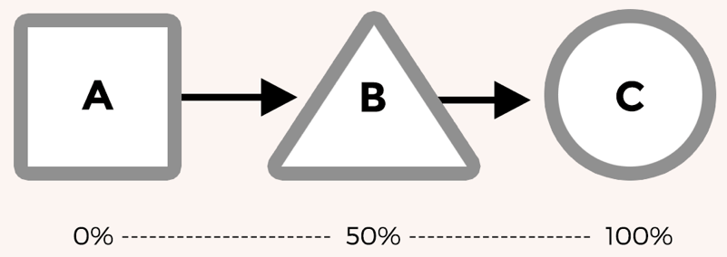

# css3中animation和transition的用法以及属性和内部原理

[本文来源于](https://h-wakanda.github.io/css-animation-101-cn)

## Transitions和Animations

> 啥是transition，其实就是从一个状态到另外一个状态的动画模拟，是一个平滑的过渡过程，而动画是多个状态间的变化。动画会更加适合相对复杂的场合。动画还有一点不同，它可以自动开始。过渡一般需要通过添加样式类或更改状态（如悬停）来触发，但动画可以在页面加载时自动启动

下面的图片可以直观的反映这两者的区别

