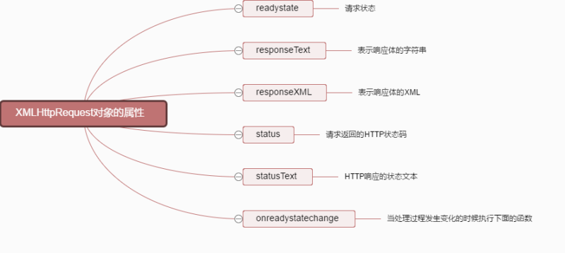
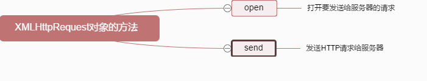
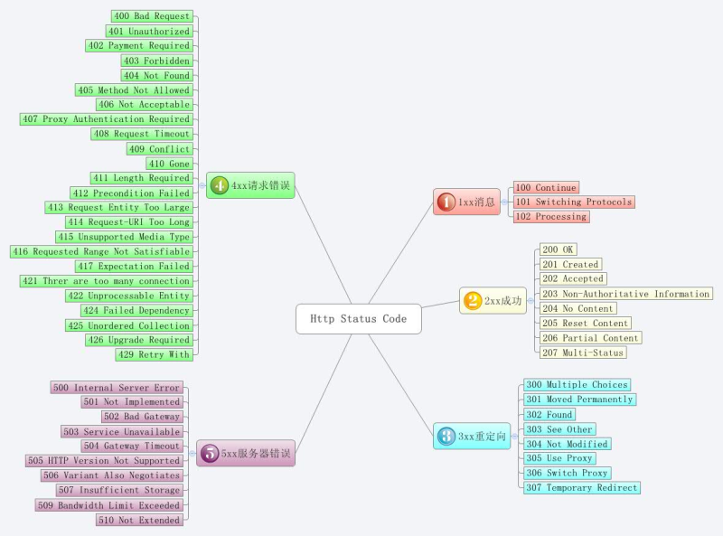

# Ajax 总结篇

## 1.Ajax简介、优劣势、应用场景以及技术

### Ajax简介

- Asynchronous Javascript And XML （异步的 JavaScript和XML）
- 它并不是一种单一的技术，而是有机利用一系列交互式网页应用相关的技术所形成的结合体
- AJAX 是一种用于创建快速动态网页的技术。通过在后台与服务器进行少量数据交换，AJAX 可以使网页实现异步更新。这意味着可以在不重新加载整个网页的情况下，对网页的某部分进行更新。

- 优点
  - 页面无刷新，用户体验好。
  - 异步通信，更加快的响应能力。
  - 减少冗余请求，减轻了服务器负担
  - 基于标准化的并被广泛支持的技术，不需要下载插件或者小程序

- 缺点
  - ajax干掉了back按钮，即对浏览器后退机制的破坏。
  - 存在一定的安全问题。
  - 对搜索引擎的支持比较弱。
  - 破坏了程序的异常机制。
  - 无法用URL直接访问

- ajax应用场景
  - 场景 1. 数据验证
  - 场景 2. 按需取数据
  - 场景 3. 自动更新页面

- ajax所包含的技术
  - ajax并非一种新的技术，而是几种原有技术的结合体。它由下列技术组合而成。
  - 使用CSS和XHTML来表示。
  - 使用DOM模型来交互和动态显示。
  - 使用XMLHttpRequest来和服务器进行异步通信。
  - 使用javascript来绑定和调用。

在上面几中技术中，除了XmlHttpRequest对象以外，其它所有的技术都是基于web标准并且已经得到了广泛使用的，XMLHttpRequest虽然目前还没有被W3C所采纳，但是它已经是一个事实的标准，因为目前几乎所有的主流浏览器都支持它



XMLHttpRequest对象的属性



XMLHttpRequest对象的方法

## 创建ajax的步骤

Ajax的原理简单来说通过XmlHttpRequest对象来向服务器发异步请求，从服务器获得数据，然后用javascript来操作DOM而更新页面。这其中最关键的一步就是从服务器获得请求数据。原生创建ajax可分为以下四步

### 创建XMLHttpRequest对象

> Ajax的核心是XMLHttpRequest对象，它是Ajax实现的关键，发送异步请求、接受响应以及执行回调都是通过它来完成所有现代浏览器（IE7+、Firefox、Chrome、Safari 以及 Opera）均内建 XMLHttpRequest 对象。

- 创建 XMLHttpRequest对象的语法：

```js
var xhr = new XMLHttpRequest();
```

- 老版本的 Internet Explorer（IE5 和 IE6）使用ActiveX 对象：

```js
var xhr = new ActiveXObject("Microsoft.XMLHTTP");
```

> 为了应对所有的现代浏览器，包括 IE5 和 IE6，请检查浏览器是否支持 XMLHttpRequest对象。如果支持，则创建XMLHttpRequest对象。如果不支持，则创建ActiveXObject：

```js
var xhr = null;
function createRequest (){
    try {
        xhr = new XMLHttpRequest();
    }catch (tryMS){
        try {
            xhr = new ActiveXObject("Msxm12.XMLHTTP");
        } catch (otherMS) {
            try {
                xhr = new ActiveXObject("Microsoft.XMLHTTP");
            }catch (failed) {
                xhr = null;
            }
        }
    }
    return xhr;
}
```

### 准备请求

- 初始化该XMLHttpRequest对象，接受三个参数：

```js
xhr.open(method,url,async);
```

- 第一个参数表示请求类型的字符串，其值可以是GET或者POST。

```js
// GET请求：
xhr.open("GET",demo.php?name=tsrot&age=24,true);
// POST请求：
xhr.open("POST",demo.php,true);
```

- 第二个参数是要作为请求发送目标的URL。
- 第三个参数是true或false，表示请求是以异步还是同步的模式发出。（默认为true，一般不建议为false）

> false：同步模式发出的请求会暂停所有javascript代码的执行，知道服务器获得响应为止，如果浏览器在连接网络时或者在下载文件时出了故障，页面就会一直挂起。
> true：异步模式发出的请求，请求对象收发数据的同时，浏览器可以继续加载页面，执行其他javascript代码。

### 发送请求

> xhr.send()

一般情况下，使用Ajax提交的参数多是些简单的字符串，可以直接使用GET方法将要提交的参数写到open方法的url参数中，此时send方法的参数为null或为空。

- GET请求：

```js
xhr.open("GET",demo.php?name=tsrot&age=24,true);
xhr.send(null);
```

- POST请求：

如果需要像 HTML 表单那样 POST 数据，请使用 setRequestHeader()来添加 HTTP 头。然后在send()方法中规定您希望发送的数据：

```js
xhr.open("POST",demo.php,true);
xhr.setRequestHeder("Content-Type","application/x-www-form-urlencoded;charset=UTF-8");
xhr.send()
```

### 处理响应

```js
xhr.onreadystatechange = function(){
    if(xhr.readyState == 4 && xhr.status == 200){
        console.log(xhr.responseText);
    }
}
```

- onreadystatechange ：当处理过程发生变化的时候执行下面的函数
- readyState:ajax处理过程
- status属性：
  - 0：请求未初始化(还没有调用 open())。
  - 1：请求已经建立，但是还没有发送(还没有调用 send())
  - 2：请求已发送，正在处理中(通常现在可以从响应中获取内容头)
  - 3：请求在处理中；通常响应中已有部分数据可用了，但是服务器还没有完成响应的生成
  - 4：响应已完成；您可以获取并使用服务器的响应了

- responseText：获得字符串形式的响应数据
- responseXML：获得 XML形式的响应数据
- 返回值一般为json字符串，可以用JSON.parse(xhr.responseText)转化为JSON对象



### 完整例子

```js
var xhr = false;

 if(XMLHttpRequest){
    xhr = new XMLHttpRequest();
 }else{
    xhr = new ActiveXObject("Microsoft.XMLHTTP");
};

if(xhr) {//如果xhr创建失败，还是原来的false
   xhr.open("GET",url,true);
   xhr.send();

   xhr.onreadystatechange = function(){
    if(xhr.readyState == 4 && xhr.status == 200){
        console.log(JSON.parse(xhr.responseText).name);
    }
    }
}
```

```json
{
    "name":"tsrot",
    "age":24
}
```

```js
function ajax(url, success, fail){
    // 1\. 创建连接
    var xhr = null;
    xhr = new XMLHttpRequest()
    // 2\. 连接服务器
    xhr.open('get', url, true)
    // 3\. 发送请求
    xhr.send(null);
    // 4\. 接受请求
    xhr.onreadystatechange = function(){
        if(xhr.readyState == 4){
            if(xhr.status == 200){
                success(xhr.responseText);
            } else { // fail
                fail && fail(xhr.status);
            }
        }
    }
}
```

## jQuery中的Ajax

> jquery对Ajax操作进行了封装，在jquery中的$.ajax()方法属于最底层的方法，第2层是load()、$.get()、$.post();第3层是$.getScript()、$.getJSON()，第2层使用频率很高

### $.get()和$.post()方法

> load()方法通常用来从web服务器上获取静态的数据文件。在项目中需要传递一些参数给服务器中的页面，那么可以使用$.get()和$.post()或$.ajax()方法

- 注意：$.get()和$.post()方法是jquery中的全局函数
- $.get()方法
  - $.get()方法使用GET方式来进行异步请求
  - 结构为：$.get(url,[data],callback,type)
    - 如果服务器返回的内容格式是xml文档，需要在服务器端设置Content-Type类型 代码如下：header("Content-Type:text/xml:charset=utf-8") //php
- $.get()方法参数解析

| 参数            | 类型           | 说明                                                              |
| :-------------  |:------------- | :-----                                                           |
| url             | String        |   请求HTML页的地址                                                 |
| data(可选)      | Object        |   发送至服务器的key/ value 数据会作为QueryString附加到请求URL中       |
| callback(可选)  | Function      |    载入成功的回调函数（只有当Response的返回状态是success才调用该方法） |
| type(可选)      | String        |    服务器返回内容的格式，包括xml、html、script、json、text和_default  |

- $.post()方法
  - 它与$.get()方法的结构和使用方式相同，有如下区别
    - GET请求会将参数跟张乃URL后进行传递，而POST请求则是作为Http消息的实体内容发送给web服务器，在ajax请求中，这种区别对用户不可见
    - GET方式对传输数据有大小限制（通常不能大于2KB），而使用POST方式传递的数据量要比GET方式大得多（理论不受限制）
    - GET方式请求的数据会被浏览器缓存起来，因此其他人可以从浏览器的历史纪录中读取这些数据，如：账号、密码。在某种情况下，GET方式会带来严重的安全问题，而POST相对来说可以避免这些问题
    - GET和POST方式传递的数据在服务端的获取也不相同。在PHP中，GET方式用$_GET[]获取；POST方式用$_POST[]获取;两种方式都可用$_REQUEST[]来获取
- 总结
  - 使用load()、$.get()和$.post()方法完成了一些常规的Ajax程序，如果还需要复杂的Ajax程序，就需要用到$.ajax()方式

### $.ajax()方法

- $.ajax()方法是jquery最底层的Ajax实现，它的结构为$.ajax(options)
- 该方法只有一个参数，但在这个对象里包含了$.ajax()方式所需要的请求设置以及回调函等信息，参数以key / value存在，所有参数都是可选的
- $.ajax()方式常用参数解析

| 参数            | 类型           | 说明                                                              |
| :-------------  |:------------- | :-----                                                            |
| url             | String        |   (默认为当前页地址)发送请求的地址                                   |
| type            | Object        |   请求方式（POST或GET）默认为GET                                    |
| timeout         | Function      |    设置请求超时时间（毫秒）                                         |
| dataType        | String        |    服务器返回内容的格式，包括xml、html、script、json、text和_default  |
| beforeSend      | Function      |    发送请求前可以修改XMLHttpRequest对象的函数，例如添加自定义HTTP头。在beforeSend中如果返回false可以取消本次Ajax请求。  |
| complete        | Function      |    请求完成后的回调函数（请求成功或失败时都调用）                      |
| success         | Function      |    请求成功后调用的回调函数，有两个参数(1)由服务器返回，并根据dataTyppe参数进行处理后的数据(2)描述状态的字符串function(data,textStatus){// code}  |
| error           | Function      |    请求失败时被调用的函数                                            |
| global          | Boolean       |    默认为true。表示是否触发全局Ajax事件，设置为false将不会触发。AjaxStart或AjaxStop可用于控制各种Ajax事件  |